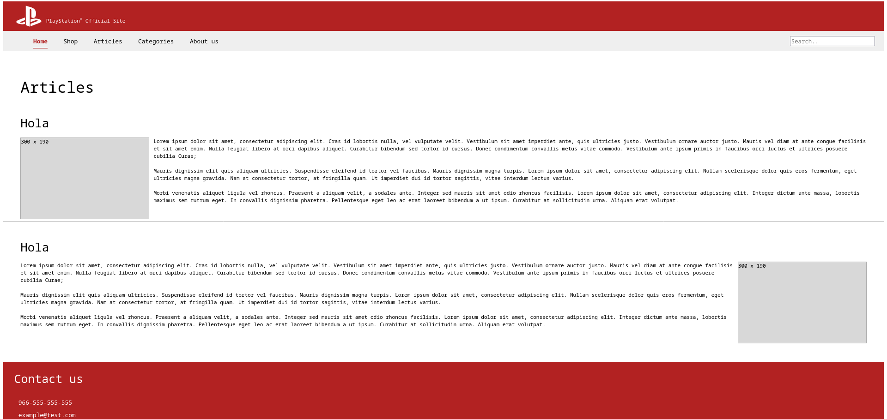

# Homework 10

You are required to use meaningful html tags to implement the next design:
 

You are free to use html and css only, or bootstrap with it.

## additional challenge

- use javascript to toggle between dark and white mode.

- the design is pretty standard for the page, try to make it better while keeping the same elements on the page and in the same positions.

**Have Fun**